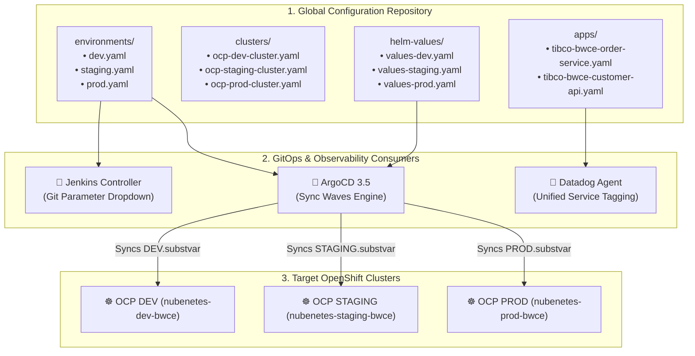

# 🌐 TIBCO BWCE Global Variables & Multi-Cluster GitOps Configuration

[](https://docs.tibco.com/)
[](https://www.datadoghq.com/)
[](https://www.redhat.com/openshift)
[](https://argo-cd.readthedocs.io/)
[](LICENSE)

Centralized Single Source of Truth (SSOT) repository storing environment configurations, cluster topologies, application profiles, Helm values, and Datadog observability settings for **TIBCO BusinessWorks™ Container Edition (BWCE)** microservices.

---

## 🏛️ SSOT Configuration Hierarchy



---

## 🏗️ Repository Structure

```
.
├── environments/                     # Environment definitions & BWCE runtime parameters
│   ├── dev.yaml                      # OCP DEV: Debug logs, DEV.substvar profile, 16 threads
│   ├── staging.yaml                  # OCP STAGING: Info logs, STAGING.substvar profile, 32 threads
│   └── prod.yaml                     # OCP PROD: Warn logs, PROD.substvar profile, 64 threads
├── clusters/                         # OpenShift cluster topology definitions
│   ├── ocp-dev-cluster.yaml          # Primary dev cluster specification
│   ├── ocp-staging-cluster.yaml      # Staging UAT cluster specification
│   └── ocp-prod-cluster.yaml         # Production cluster specification
├── apps/                             # Application catalog & BWCE configurations
│   ├── applications-inventory.yaml   # Service inventory for Backstage IDP / Jenkins
│   ├── tibco-bwce-order-service.yaml # Order service spec & Datadog tags
│   └── tibco-bwce-customer-api.yaml  # Customer API gateway spec
├── helm-values/                      # OpenShift Helm values per service & environment
│   ├── tibco-bwce-order-service/     # Values with Datadog annotations & BW_PROFILE
│   └── tibco-bwce-customer-api/
├── secrets-templates/                # Zero-trust templates (DB, JMS, Datadog)
└── secrets/                          # External Secrets Operator (ESO) Vault sync
```

---

## 🎯 TIBCO BWCE Best Practices Implemented

1. **Profile Externalization via `.substvar`**:
   Environment-specific configurations (`DEV.substvar`, `STAGING.substvar`, `PROD.substvar`) are cleanly decoupled from the application archive (`.ear`) and injected at runtime using `BW_PROFILE`.
2. **Engine Tuning & 12-Factor Design**:
   - `BW_ENGINE_THREADCOUNT`: Dynamically scaled per environment (16 in DEV, 32 in STAGING, 64 in PROD).
   - `BW_STEP_FLOWLIMIT`: Throttles memory footprint during high-throughput burst traffic.
   - `BW_CONTAINER_SHUTDOWN_TIMEOUT_SECONDS`: Ensures graceful in-flight process completion upon SIGTERM.
3. **Datadog Unified Service Tagging**:
   Standardized `env`, `service`, and `version` tags injected across K8s labels, container env vars, and JVM parameters (`-javaagent:/opt/datadog/dd-java-agent.jar`).
4. **OpenShift `restricted-v2` Compliance**:
   All workloads run as non-root user `uid: 1001` with read-only root filesystems and explicit ephemeral storage.

---

## 🔗 Related Repositories
- **Orchestration Platform**: [jenkins-git-parameter-bwce](https://github.com/nubenetes/jenkins-git-parameter-bwce)
