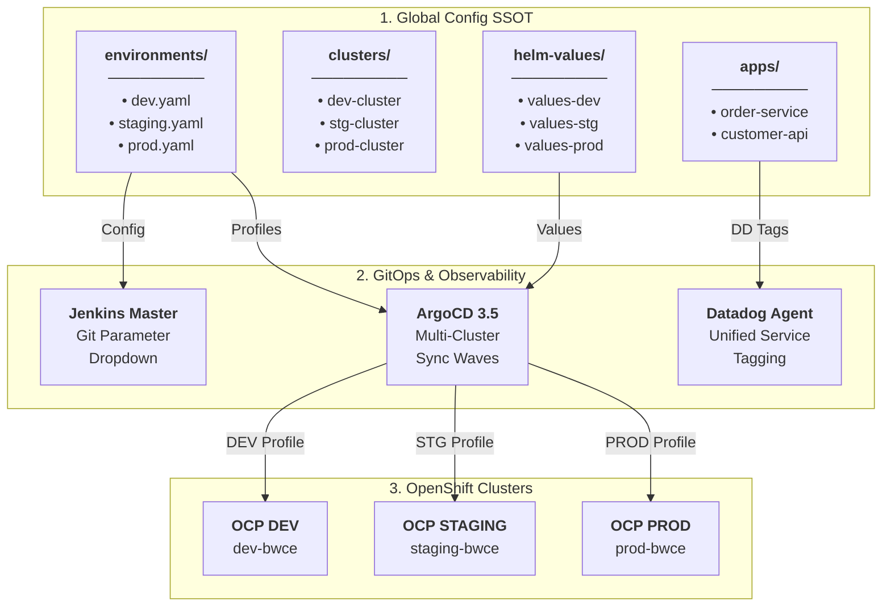

# 🌐 TIBCO BWCE Global Variables & Multi-Cluster GitOps Configuration

[](#)
[](#)
[](https://docs.tibco.com/)
[](https://www.datadoghq.com/)
[](https://argo-cd.readthedocs.io/)
[](https://www.redhat.com/openshift)
[](https://kubernetes.io/)
[](https://plugins.jenkins.io/git-parameter/)
[](https://external-secrets.io/)
[](https://12factor.net/)
[](LICENSE)

Centralized Single Source of Truth (SSOT) repository storing environment configurations, cluster topologies, application profiles, Helm values, and Datadog observability settings for **TIBCO BusinessWorks™ Container Edition (BWCE)** microservices.

---

> [!IMPORTANT]
> ### ⚠️ Architectural Blueprint & Sovereign Environment Notice
> - **Non-Production Testing Status**: This repository serves as an **architectural reference blueprint, educational design pattern, and foundational boilerplate**. It has **not been tested or executed in a live production environment**.
> - **Sovereign & Air-Gapped Boilerplate**: This project is engineered as a deterministic, version-controlled Infrastructure-as-Code (IaC) template that can be safely used as a **standardized boilerplate in enterprise environments where Agentic AI / LLMs are prohibited** due to data sovereignty, compliance regulations, intellectual property protection, or air-gapped security policies.
> - **Enterprise Hardening**: Platform engineers must review, adapt, and validate all cluster endpoints, TLS certificates, HashiCorp Vault configurations, Datadog API keys, and RBAC quotas prior to production adoption.
> - **AI Model Attribution & Review**: Originally generated using **Gemini 3.7 Flash** with **Antigravity**, subsequently audited, verified, and hardened using **Gemini 3.8 Flash**.
> - **Origin & Real-World Heritage**: This blueprint is based on [nubenetes/jenkins-git-parameter](https://github.com/nubenetes/jenkins-git-parameter) and [nubenetes/jenkins-git-parameter-global-vars](https://github.com/nubenetes/jenkins-git-parameter-global-vars), drawing directly from the author's personal hands-on experience designing and operating enterprise integration platforms with these exact requirements (engineered just before agentic AI became widespread).

> [!TIP]
> ### 🚀 Companion Repository (CI/CD & GitOps Orchestration Platform)
> This configuration SSOT is consumed directly by the orchestration platform:  
> 🚀 **[nubenetes/jenkins-git-parameter-bwce](https://github.com/nubenetes/jenkins-git-parameter-bwce)**  
> *(Contains Jenkins JCasC, Job DSL multi-remote pipelines, Datadog Java APM agent injection, ArgoCD 3.5, and Argo Rollouts Canary)*

---

<a id="quick-navigation-map"></a>
## 🗺️ Quick Navigation Map

This repository houses the centralized Configuration Single Source of Truth (SSOT), decoupled from the pipeline orchestration engine. Use this blueprint to navigate configurations, cluster topologies, and multimedia resources:

### 🧭 Repository Architecture Blueprint
```text
jenkins-git-parameter-bwce-global-vars/  # 🌐 Centralized Configuration SSOT
├── 📁 environments/                     # Environment definitions (dev.yaml, staging.yaml, prod.yaml)
│   ├── 📄 dev.yaml                      # OCP DEV: Debug logs, DEV.substvar profile, 16 threads
│   ├── 📄 staging.yaml                  # OCP STAGING: Info logs, STAGING.substvar profile, 32 threads
│   └── 📄 prod.yaml                     # OCP PROD: Warn logs, PROD.substvar profile, 64 threads
├── 📁 clusters/                         # OpenShift cluster topology definitions
│   ├── 📄 ocp-dev-cluster.yaml          # Primary dev cluster specification
│   ├── 📄 ocp-staging-cluster.yaml      # Staging UAT cluster specification
│   └── 📄 ocp-prod-cluster.yaml         # Production cluster specification
├── 📁 apps/                             # Application catalog & BWCE configurations
│   ├── 📄 applications-inventory.yaml   # Service inventory for Backstage IDP / Jenkins
│   ├── 📄 tibco-bwce-order-service.yaml # Order service spec & Datadog tags
│   └── 📄 tibco-bwce-customer-api.yaml  # Customer API gateway spec
├── 📁 helm-values/                      # OpenShift Helm values per service & environment
│   ├── 📁 tibco-bwce-order-service/     # Values with Datadog annotations & BW_PROFILE
│   └── 📁 tibco-bwce-customer-api/
├── 📁 secrets-templates/                # Zero-trust templates (DB, JMS, Datadog)
└── 📁 secrets/                          # External Secrets Operator (ESO) Vault sync

jenkins-git-parameter-bwce/              # 🚀 CI/CD & GitOps Orchestration Platform
├── 📁 jcasc/                            # Jenkins Configuration as Code (JCasC 2.492.2 LTS)
├── 📁 jobdsl/                           # Programmatic pipeline definitions (Job DSL API)
├── 📁 argocd-apps/                      # ArgoCD Application & ApplicationSet manifests
└── 📁 helm/                             # Helm charts for Jenkins, Vault, and BWCE apps
```

<a id="ai-multimedia-series"></a>
## 🎬 AI-Generated Multimedia Series (YouTube)

This repository is accompanied by an educational video masterclass and technical shorts synthesized with **Gemini NotebookLM** based directly on the architectural patterns, multi-cluster GitOps configurations, and enterprise security controls from this project. All videos are freely accessible on YouTube on the [**@nubenetes**](https://youtube.com/@nubenetes) channel.

> [!NOTE]
> **Multilingual Learning Experience**:  
> Content features native spoken audio in **English 🇺🇸**, with automated YouTube closed captions (CC) translated into **Spanish 🇪🇸 and 20+ languages** for global engineering teams.

### 📽️ Full-Length Technical Deep Dives (Architecture Masterclasses)

| # | Video Guide Title | Engineering Domain & Core Architecture | Duration | Direct Link |
|:---:|:---|:---|:---:|:---:|
| **01** | [TIBCO BWCE Modernization with jenkins git parameter](https://www.youtube.com/watch?v=PaS5pkjBIXU) | **Cloud-Native Modernization & CFS Quota Fix**<br/>12-Factor .substvar profile externalization, removing CPU limits & Datadog APM | `9:57` | [▶️ Watch](https://www.youtube.com/watch?v=PaS5pkjBIXU) |
| **02** | [DevSecOps Fortress Blueprint](https://www.youtube.com/watch?v=ofQfc-NgoUQ) | **Zero-Trust DevSecOps & Supply Chain Security**<br/>SLSA Level 3, Cosign image signing, CycloneDX SBOM & HashiCorp Vault secrets | `7:42` | [▶️ Watch](https://www.youtube.com/watch?v=ofQfc-NgoUQ) |
| **03** | [Multi Repo CI CD Puzzle](https://www.youtube.com/watch?v=kH7Hweim5oY) | **Multi-Repo Decoupling & ArgoCD GitOps**<br/>Solving the SCM render paradox, separating CI code from global-vars config SSOT | `7:32` | [▶️ Watch](https://www.youtube.com/watch?v=kH7Hweim5oY) |

### ⚡ Video Shorts Matrix

| # | Short Title | Architectural Domain & Focus | Duration | Action |
|:---:|:---|:---|:---:|:---:|
| **01** | [How Canary Deployments Auto Rollback](https://www.youtube.com/shorts/GUmnvmFmXxk) | **Progressive Delivery & SLA Tripwires**<br/>Argo Rollouts 20/80 traffic split with Datadog real-time 5xx/latency rollbacks | `1:28` | [▶️ Watch](https://www.youtube.com/shorts/GUmnvmFmXxk) |
| **02** | [Why CPU Limits Freeze TIBCO BWCE](https://www.youtube.com/shorts/MNl8eUYzkDQ) | **Linux CFS Kernel Quota Throttling**<br/>Eliminating pod CPU limits on 64-thread JVMs & managing quota via ResourceQuotas | `1:32` | [▶️ Watch](https://www.youtube.com/shorts/MNl8eUYzkDQ) |

*For complete technical summaries, topic breakdowns, and direct studio links, see [Section: Video Walkthroughs & Architecture References](#video-walkthroughs--architecture-references-youtube).*

---

## 🏛️ SSOT Configuration Hierarchy

<details>
<summary>🗺️ <b>Click to expand: SSOT Configuration Hierarchy & Multi-Cluster Mapping Diagram</b></summary>
<br/>


```mermaid
flowchart TB
    subgraph ConfigSSOT ["1. Global Config SSOT"]
        direction TB
        Envs["<b>environments/</b><br/>─────────<br/>• dev.yaml<br/>• staging.yaml<br/>• prod.yaml"]
        Clusters["<b>clusters/</b><br/>─────────<br/>• dev-cluster<br/>• stg-cluster<br/>• prod-cluster"]
        Apps["<b>apps/</b><br/>─────────<br/>• order-service<br/>• customer-api"]
        HelmVal["<b>helm-values/</b><br/>─────────<br/>• values-dev<br/>• values-stg<br/>• values-prod"]
    end

    subgraph Consumers ["2. GitOps & Observability"]
        direction TB
        Jenkins["<b>Jenkins Master</b><br/>Git Parameter<br/>Dropdown"]
        ArgoCD["<b>ArgoCD 3.5</b><br/>Multi-Cluster<br/>Sync Waves"]
        Datadog["<b>Datadog Agent</b><br/>Unified Service<br/>Tagging"]
    end

    subgraph TargetClusters ["3. OpenShift Clusters"]
        direction TB
        Dev["<b>OCP DEV</b><br/>dev-bwce"]
        Staging["<b>OCP STAGING</b><br/>staging-bwce"]
        Prod["<b>OCP PROD</b><br/>prod-bwce"]
    end

    Envs -->|"Config"| Jenkins
    Envs -->|"Profiles"| ArgoCD
    HelmVal -->|"Values"| ArgoCD
    Apps -->|"DD Tags"| Datadog

    ArgoCD -->|"DEV Profile"| Dev
    ArgoCD -->|"STG Profile"| Staging
    ArgoCD -->|"PROD Profile"| Prod
```

</details>

---

## 🏗️ Repository Structure

```
.
├── environments/                     # Environment definitions & BWCE runtime parameters
│   ├── dev.yaml                      # OCP DEV: Debug logs, DEV.substvar profile, 16 threads
│   ├── staging.yaml                  # OCP STAGING: Info logs, STAGING.substvar profile, 32 threads
│   └── prod.yaml                     # OCP PROD: Warn logs, PROD.substvar profile, 64 threads
├── clusters/                         # OpenShift cluster topology definitions
│   ├── ocp-dev-cluster.yaml          # Primary dev cluster specification
│   ├── ocp-staging-cluster.yaml      # Staging UAT cluster specification
│   └── ocp-prod-cluster.yaml         # Production cluster specification
├── apps/                             # Application catalog & BWCE configurations
│   ├── applications-inventory.yaml   # Service inventory for Backstage IDP / Jenkins
│   ├── tibco-bwce-order-service.yaml # Order service spec & Datadog tags
│   └── tibco-bwce-customer-api.yaml  # Customer API gateway spec
├── helm-values/                      # OpenShift Helm values per service & environment
│   ├── tibco-bwce-order-service/     # Values with Datadog annotations & BW_PROFILE
│   └── tibco-bwce-customer-api/
├── secrets-templates/                # Zero-trust templates (DB, JMS, Datadog)
└── secrets/                          # External Secrets Operator (ESO) Vault sync
```

---

## 🎯 TIBCO BWCE Best Practices Implemented

1. **Profile Externalization via `.substvar`**:
   Environment-specific configurations (`DEV.substvar`, `STAGING.substvar`, `PROD.substvar`) are cleanly decoupled from the application archive (`.ear`) and injected at runtime using `BW_PROFILE`.
2. **Engine Tuning & 12-Factor Design (No CPU Limits + Namespace Governance)**:
   - **No CPU Limits on Pods**: CPU limits are intentionally omitted at the container level to eliminate Linux CFS Bandwidth Throttling on multi-threaded JVM/BWCE processes.
   - **Namespace ResourceQuotas**: Aggregate cluster CPU/Memory consumption is governed at the OpenShift Project boundary ([`cluster-quotas/namespace-resource-quota.yaml`](cluster-quotas/namespace-resource-quota.yaml)).
   - `BW_ENGINE_THREADCOUNT`: Dynamically scaled per environment (16 in DEV, 32 in STAGING, 64 in PROD).
   - `BW_STEP_FLOWLIMIT`: Throttles memory footprint during high-throughput burst traffic.
   - `BW_CONTAINER_SHUTDOWN_TIMEOUT_SECONDS`: Ensures graceful in-flight process completion upon SIGTERM.
3. **Datadog Unified Service Tagging**:
   Standardized `env`, `service`, and `version` tags injected across K8s labels, container env vars, and JVM parameters (`-javaagent:/opt/datadog/dd-java-agent.jar`).
4. **OpenShift `restricted-v2` Compliance**:
   All workloads run as non-root user `uid: 1001` with read-only root filesystems and explicit ephemeral storage.

---

## 📽️ Video Walkthroughs & Architecture References (YouTube)

Architectural deep dives, video walkthroughs, and technical shorts for centralized TIBCO BWCE configuration, profile externalization, and multi-cluster GitOps delivery on OpenShift 4.20+ are hosted on the **[Nubenetes YouTube Channel (@nubenetes)](https://www.youtube.com/@nubenetes)**.

<details open>
<summary>📂 <strong>Full-Length Technical Deep Dives (Architecture Masterclasses)</strong></summary>

<br/>

##### 1. TIBCO BWCE Modernization with jenkins git parameter
- 🔗 **Direct Link**: [https://www.youtube.com/watch?v=PaS5pkjBIXU](https://www.youtube.com/watch?v=PaS5pkjBIXU)
- 🌐 **Origin Language**: English (Subtitles in 20+ languages)
- ⏱️ **Duration**: 9:57
- 🏷️ **Engineering Domain**: Cloud-Native Modernization, 12-Factor Profile Externalization & Linux CFS Quota Fix
- 📝 **Technical Overview**:
Architectural blueprint for modernizing legacy TIBCO BusinessWorks Container Edition (BWCE 2.9.2 / 2.10.0) microservices on Red Hat OpenShift 4.20+. Explains 12-factor configuration externalization via `.substvar`, eliminating pod CPU limits to prevent Linux CFS quota bandwidth throttling on 64-thread engines, OpenMetrics scraping on port 8090, and automated canary rollouts with Argo Rollouts and Datadog APM.
- 🛠️ **Direct Links**: [Watch on YouTube](https://www.youtube.com/watch?v=PaS5pkjBIXU) | [Edit in YouTube Studio](https://studio.youtube.com/video/PaS5pkjBIXU/edit)

##### 2. DevSecOps Fortress Blueprint
- 🔗 **Direct Link**: [https://www.youtube.com/watch?v=ofQfc-NgoUQ](https://www.youtube.com/watch?v=ofQfc-NgoUQ)
- 🌐 **Origin Language**: English (Subtitles in 20+ languages)
- ⏱️ **Duration**: 7:42
- 🏷️ **Engineering Domain**: Zero-Trust DevSecOps, Supply Chain Security & Vault Secrets
- 📝 **Technical Overview**:
Zero-trust security architecture for enterprise TIBCO BWCE microservices on OpenShift. Covers SLSA Level 3 supply chain provenance, cryptographic image signing with Sigstore Cosign, automated vulnerability scanning with Aqua Trivy, CycloneDX 1.5 SBOM generation, dynamic secret injection with HashiCorp Vault and External Secrets Operator (ESO), and running under OpenShift restricted-v2 SecurityContextConstraints.
- 🛠️ **Direct Links**: [Watch on YouTube](https://www.youtube.com/watch?v=ofQfc-NgoUQ) | [Edit in YouTube Studio](https://studio.youtube.com/video/ofQfc-NgoUQ/edit)

##### 3. Multi Repo CI CD Puzzle
- 🔗 **Direct Link**: [https://www.youtube.com/watch?v=kH7Hweim5oY](https://www.youtube.com/watch?v=kH7Hweim5oY)
- 🌐 **Origin Language**: English (Subtitles in 20+ languages)
- ⏱️ **Duration**: 7:32
- 🏷️ **Engineering Domain**: Multi-Repository Decoupling & ArgoCD Multi-Cluster GitOps
- 📝 **Technical Overview**:
Deconstructs the multi-repository decoupling challenge when separating application source code (jenkins-git-parameter-bwce) from global configuration topologies (jenkins-git-parameter-bwce-global-vars). Solves the SCM pre-execution render paradox inherent to Jenkins git-parameter dropdowns and demonstrates the shift to declarative, pull-based GitOps with ArgoCD 3.5 across multi-cluster OpenShift topologies.
- 🛠️ **Direct Links**: [Watch on YouTube](https://www.youtube.com/watch?v=kH7Hweim5oY) | [Edit in YouTube Studio](https://studio.youtube.com/video/kH7Hweim5oY/edit)

</details>

<details open>
<summary>📂 <strong>Technical Shorts Matrix & Architecture Breakdowns</strong></summary>

<br/>

### ⚡ Video Shorts Matrix

| # | Short Title | Architectural Domain & Focus | Duration | Action |
|:---:|:---|:---|:---:|:---:|
| **01** | [How Canary Deployments Auto Rollback](https://www.youtube.com/shorts/GUmnvmFmXxk) | **Progressive Delivery & SLA Tripwires**<br/>Argo Rollouts 20/80 traffic split with Datadog real-time 5xx/latency rollbacks | `1:28` | [▶️ Watch](https://www.youtube.com/shorts/GUmnvmFmXxk) |
| **02** | [Why CPU Limits Freeze TIBCO BWCE](https://www.youtube.com/shorts/MNl8eUYzkDQ) | **Linux CFS Kernel Quota Throttling**<br/>Eliminating pod CPU limits on 64-thread JVMs & managing quota via ResourceQuotas | `1:32` | [▶️ Watch](https://www.youtube.com/shorts/MNl8eUYzkDQ) |

<br/>

##### 1. How Canary Deployments Auto Rollback
- 🔗 **Direct Link**: [https://www.youtube.com/shorts/GUmnvmFmXxk](https://www.youtube.com/shorts/GUmnvmFmXxk)
- 🌐 **Origin Language**: English (Subtitles in 20+ languages)
- ⏱️ **Duration**: 1:28
- 🏷️ **Engineering Domain**: Progressive Delivery, Argo Rollouts & Datadog SLA Analysis
- 📝 **Technical Overview**:
Demonstrates how progressive canary delivery protects mission-critical enterprise integration services. Details traffic splitting with Argo Rollouts (routing 20% traffic to canary and 80% to stable) and continuous Datadog APM SLA evaluation (5xx error rate under 0.1%, P99 latency under 250ms), triggering instant automated rollbacks when thresholds are breached.
- 🛠️ **Direct Links**: [Watch Short](https://www.youtube.com/shorts/GUmnvmFmXxk) | [Edit in YouTube Studio](https://studio.youtube.com/video/GUmnvmFmXxk/edit)

##### 2. Why CPU Limits Freeze TIBCO BWCE
- 🔗 **Direct Link**: [https://www.youtube.com/shorts/MNl8eUYzkDQ](https://www.youtube.com/shorts/MNl8eUYzkDQ)
- 🌐 **Origin Language**: English (Subtitles in 20+ languages)
- ⏱️ **Duration**: 1:32
- 🏷️ **Engineering Domain**: Linux Kernel cgroups, CFS Quota Bandwidth Throttling & JVM Sizing
- 📝 **Technical Overview**:
Unpacks the counterintuitive Linux Completely Fair Scheduler (CFS) bandwidth throttling trap on containerized multi-threaded JVMs like TIBCO BWCE. Explains why setting pod-level CPU limits divides CPU time into discrete 100ms budgetary windows that 64 engine threads exhaust immediately, causing kernel freezes despite idle node CPU. Demonstrates the production fix: removing container CPU limits and managing capacity at the namespace boundary via OpenShift ResourceQuotas.
- 🛠️ **Direct Links**: [Watch Short](https://www.youtube.com/shorts/MNl8eUYzkDQ) | [Edit in YouTube Studio](https://studio.youtube.com/video/MNl8eUYzkDQ/edit)

</details>

---

## 🔗 Related Repositories
- **Orchestration Platform**: [jenkins-git-parameter-bwce](https://github.com/nubenetes/jenkins-git-parameter-bwce)
- **Base Generic Global Variables SSOT**: [nubenetes/jenkins-git-parameter-global-vars](https://github.com/nubenetes/jenkins-git-parameter-global-vars)
- **Base Generic CI/CD Blueprint**: [nubenetes/jenkins-git-parameter](https://github.com/nubenetes/jenkins-git-parameter)
